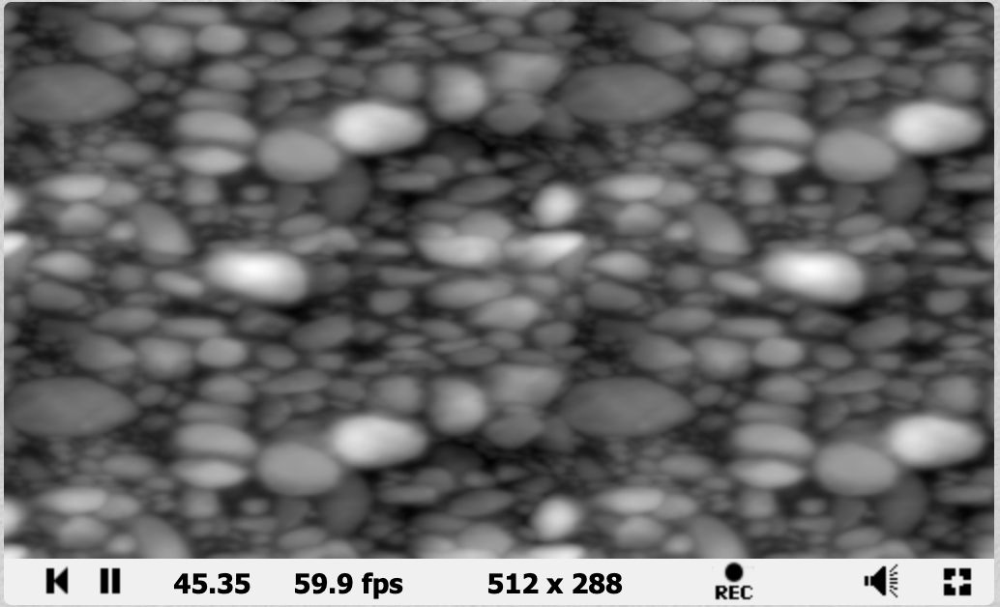

-------
**Creator:** Gavril Tango

**Created:** May 2020

**Description:** This README is for Lab 6. It  holds the screenshot of my imported texture, the link to my Shadertoy project and a link to another cool Shadertoy project.

-------

**Screenshot of Texture(Duplicated):**

**Link to Personal Shadertoy Project**

https://www.shadertoy.com/view/wsfBWf

**Link to Other Shadertoy Project

https://www.shadertoy.com/view/wdXBzs

There is some insane math involved with this one. And the commenting on the project code is just ... wow.
